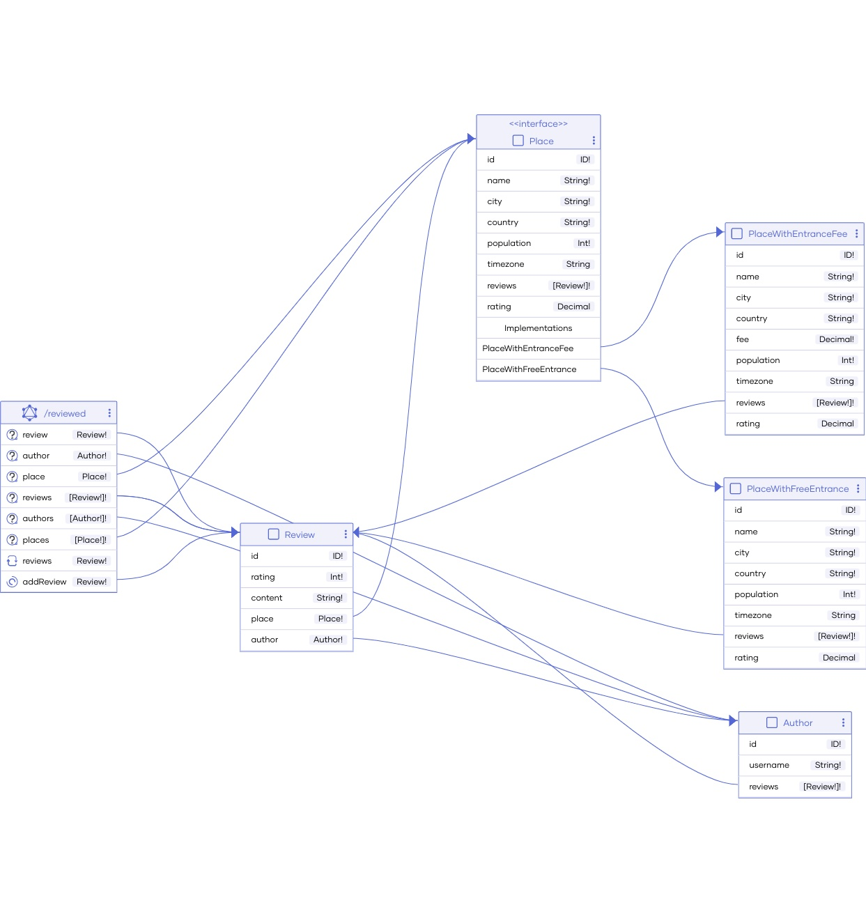

# Backend implementation for Reviewed!

A backend implementation for Reviewed!, a platform to review places.

Reviewed! let's you 
- retrieve all places for which reviews can be done, with city, country, and rating
- retrieve details of a specific place, including city, country, rating, time zone, city population, and all the current reviews for the place
- retrieve all the reviews by a particular author
    - a review consists of a rating and review content for a particular place

### GraphQL diagram generated by Ballerina

### Developing the GraphQL backend

#### Level 0 - Initial data

- Branch - https://github.com/ballerina-guides/wso2con-24/tree/session-3-level-0

- Consists of in-memory data to get started with the GraphQL implementation.

- Three main entities: Place, Author, and Review

    

- Use this to implement level 1.

    i. return all places with data in the places table - id, name, city, country, and entryFee

    ii. incorporate population and time zone information from https://public.opendatasoft.com/explore/dataset/geonames-all-cities-with-a-population-500/api/?disjunctive.country 
        - URL - https://public.opendatasoft.com/api/explore/v2.1/catalog/datasets
        - path - string `/geonames-all-cities-with-a-population-500/records?refine=name:${
            city}&refine=country:${country}` 

#### Level 1 - Record as output type

- Branch - https://github.com/ballerina-guides/wso2con-24/tree/session-3-level-1

- Consists of the GraphQL service implementation to retrieve `places` with additional city information, with records as output object types.

- But records, may not always be ideal if additional work is done to resolve fields, since it will be unnecessary if such a field is not requested. Similarly, records aren't ideal when there are relationships between objects and each object needs to be accessible via the other (e.g., review via place and place via review). For level 2, we will change record output type to an object output type.

#### Level 2 - Object as output type

- Branch - https://github.com/ballerina-guides/wso2con-24/tree/session-3-level-2

- Consists of the GraphQL service implementation to retrieve `places` with additional city information, but with Ballerina service objects as output object types.

    This change ensures additional work is done if and only when requested.
    
    > Note: even with this approach, the remote method call for a city is repeated when both the population and the time zone are requested. Similarly, the calls are repeated when there are multiple places in the same city. Ballerina supports data loaders to avoid this - incorporated in Level 8.

- Demonstrates how types that include nil translate to allowing partial data to be returned even when a particular field cannot be resolved.

- For level 3, let's 

    i. introduce the rest of the output objects - `Author` and `Review`

    ii. introduce a query that accepts arguments (`place` to retrieve place data for a given place ID)

#### Level 3 - Introduce object types with relationships and queries with arguments

- Branch - https://github.com/ballerina-guides/wso2con-24/tree/session-3-level-3

- Consists of objects for Review and Author and introduces the relationships.

- Also introduces the `place` query that accepts the place ID as an argument and to expose place information relevant to the place with the given ID. 

- As the next step (level 4), let's add a mutation operation, to add a new review.

#### Level 4 - Introduce a mutation operation to add a review

- Branch - https://github.com/ballerina-guides/wso2con-24/tree/session-3-level-4

- Introduces a mutation operation, which is the GraphQL way of performing an update.

- Also introduces records as GraphQL input object types to accept structured input.

- Now that we have updates, next (level 5), let's introduce a subscription operation, the GraphQL way for real-time, continuous updates. Let's introduce a subscription for reviews for a particular place.
